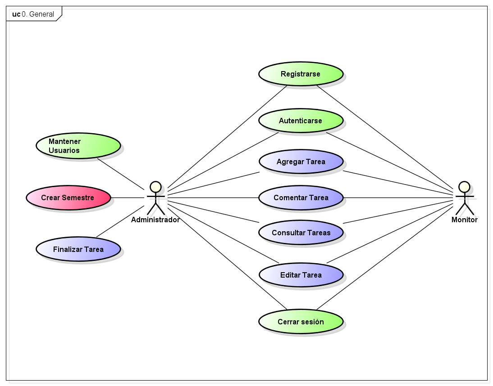
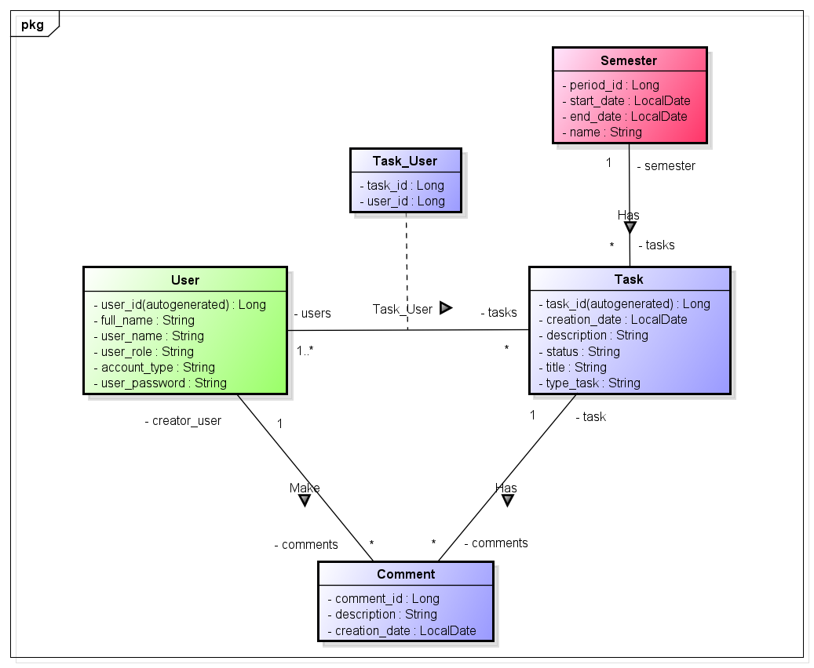
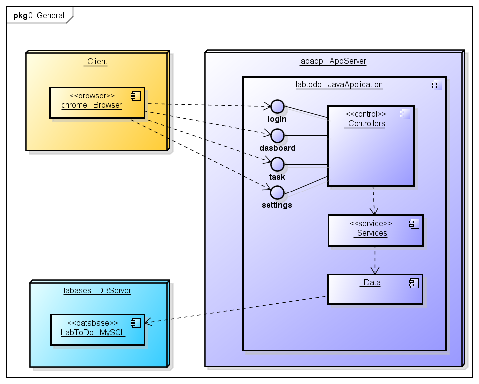

# LabToDo

## Descripción del Proyecto

LabToDo es una aplicación web que permite a los usuarios gestionar las tareas del laboratorio de informática. Los usuarios pueden añadir tareas a su lista, marcarlas como completadas y añadir comentarios a cada tarea. Cada tarea registra su fecha de creación y el usuario que la ha realizado.

La aplicación también cuenta con un sistema de autenticación, permitiendo a los usuarios iniciar sesión en sus cuentas. Además, los usuarios tienen roles específicos que determinan sus permisos dentro de la aplicación. Esta estructura de roles permite una gestión de tareas flexible y segura, adaptándose a las necesidades de diferentes tipos de usuarios.


## Comenzando 🚀

Las siguientes instrucciones le permitirán obtener una copia del proyecto en funcionamiento en su máquina local para fines de desarrollo y prueba.

### Requisitos 📋

- [Git](https://git-scm.com/) - Control de versiones
- [Maven](https://maven.apache.org/) - Manejador de dependencias
- [Java](https://www.oracle.com/java/technologies/downloads/#java17) - Lenguaje de programación
- [Docker](https://www.docker.com/) - Contenedor de aplicaciones

> [!IMPORTANT]
> Es necesario tener instalado Git, Maven, Docker y Java 17 para poder ejecutar el proyecto con efectos de desarrollo.

### Instalación 🔧

Realice los siguientes pasos para clonar el proyecto en su máquina local.

1. Descarga el código del proyecto utilizando

    ```bash
    git clone https://github.com/Laboratorio-de-Informatica/LabToDo.git
    cd LabToDo
    ```

2. Asegúrate de tener Docker instalado o una base de datos MySQL disponible.

    Para el uso de Docker, puedes utilizar el comando para ejecutar un contenedor de MySQL:

    ```bash
    docker run -p 3306:3306 --name some-mysql -e MYSQL_ROOT_PASSWORD=my-secret-pw -d mysql:latest
    ```

    En caso de que tengas una base de datos MySQL disponible, puedes cambiar las propiedades de la base de datos en el archivo `application.properties` que se encuentra en la ruta `src\main\resources\` para que la aplicación se conecte a tu base de datos.

    Ejemplo de ejecución local con un contenedor de Docker:

    ```properties
    spring.datasource.url=jdbc:mysql://localhost:3306/labtodo?createDatabaseIfNotExist=true
    spring.datasource.username=root
    spring.datasource.password=my-secret-pw
    ```

    En el previo ejemplo el nombre de la base de datos es `labtodo` ésta se crea si no existe, el usuario es `root` y la contraseña es `my-secret-pw`. Puedes cambiar estos valores según tus necesidades. El usuario de acceso a la base de datos debe tener permisos de creación de tablas y de inserción, actualización y eliminación de datos.

3. Si cambias propiedades de la base de datos como la contraseña o el usuario en el archivo `application.properties`, debes compilar el proyecto de nuevo con Maven. Para hacerlo, utiliza el comando:

    ```bash
    mvn clean compile spring-boot:run
    ```

    Podrás encontrar tu aplicacion en http://localhost:8080/login.xhtml, deberas crear un usuario provisional registrando un usuario y dandole permisos de `Administrador` y estado de cuenta `Activo` con un    cliente de base de datos como [DBeaver](https://dbeaver.io/)

   

5. Si desea empaquetar en un jar asegurate de tener el `application.properties` configuardo con la base de datos a la que te vas a conectar luego de eso ejecuta el comando:

    ```bash
    mvn clean package
    ```

6. Para ejectuar la aplicacion usa el siguiente comando:

    ```bash
    java -jar target/labtodo.jar
    ```

## Dependencias 🛠️

Se está utilizando el framework de Spring Boot para el desarrollo de la aplicación. Las dependencias utilizadas son:

- 

    La versión de Java indicada es la versión utilizada para el desarrollo de la aplicación.

- 

    Maven es la herramienta utilizada para la construcción del proyecto. La versión de Maven indicada es la versión utilizada para el desarrollo de la aplicación.

- 

    Spring Boot es el framework utilizado para el desarrollo de la aplicación. La versión de Spring Boot indicada es la versión utilizada para el desarrollo de la aplicación.

- 

    Spring Security Crypto es la dependencia utilizada para la encriptación de contraseñas. La versión de Spring Security Crypto indicada es la versión utilizada para el desarrollo de la aplicación.

- 

    MySQL Conector es la dependencia utilizada para la conexión con la base de datos MySQL. La versión de MySQL Conector indicada es la versión utilizada para el desarrollo de la aplicación.

- 

    Join Faces es la dependencia utilizada para la integración de PrimeFaces con Spring Boot. La versión de Join Faces indicada es la versión utilizada para el desarrollo de la aplicación.

- 

    Prime Faces es la dependencia utilizada para la interfaz gráfica de la aplicación. La versión de Prime Faces indicada es la versión utilizada para el desarrollo de la aplicación.

- 

    Embedded Tomcat es la dependencia utilizada para el servidor web embebido de la aplicación. La versión de Embedded Tomcat indicada es la versión utilizada para el desarrollo de la aplicación.

- 

    Lombok es la dependencia utilizada para la generación de getters, setters, constructores y otros métodos. La versión de Lombok indicada es la versión utilizada para el desarrollo de la aplicación.

> [!TIP]
> Si se desea utilizar una versión diferente de las dependencias indicadas, se debe cambiar la versión en el archivo `pom.xml` que se encuentra en la raíz del proyecto. Luego de esto se debe compilar el proyecto de nuevo con Maven.

## Diagramas

Los casos de uso de la aplicación son los siguientes:



El diagrama de conceptos es el siguiente:



El diagrama de despliegue de la aplicación es el siguiente:



## Autores ✒️

Equipo de monitores del laboratorio de informática de la Universidad Escuela Colombiana de Ingeniería Julio Garavito 2023-2.

- **Daniel Santanilla** - [ELS4NTA](https://github.com/ELS4NTA)
- **Andres Oñate** - [AndresOnate](https://github.com/AndresOnate)
- **David Valecia** - [DavidVal6](https://github.com/DavidVal6)
- **Angie Mojica** - [An6ie02](https://github.com/An6ie02)

## Licencia 📄

[](https://creativecommons.org/licenses/by-sa/4.0/)

Este proyecto está bajo la licencia de Creative Commons Reconocimiento-CompartirIgual 4.0 Internacional (CC BY-SA 4.0) para más detalles consulte el archivo [LICENSE](LICENSE)
